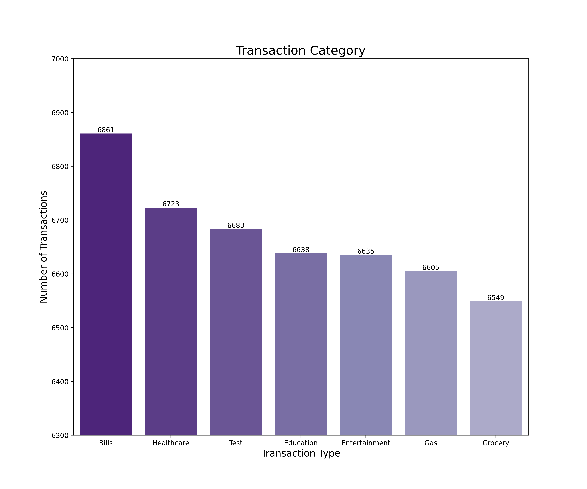
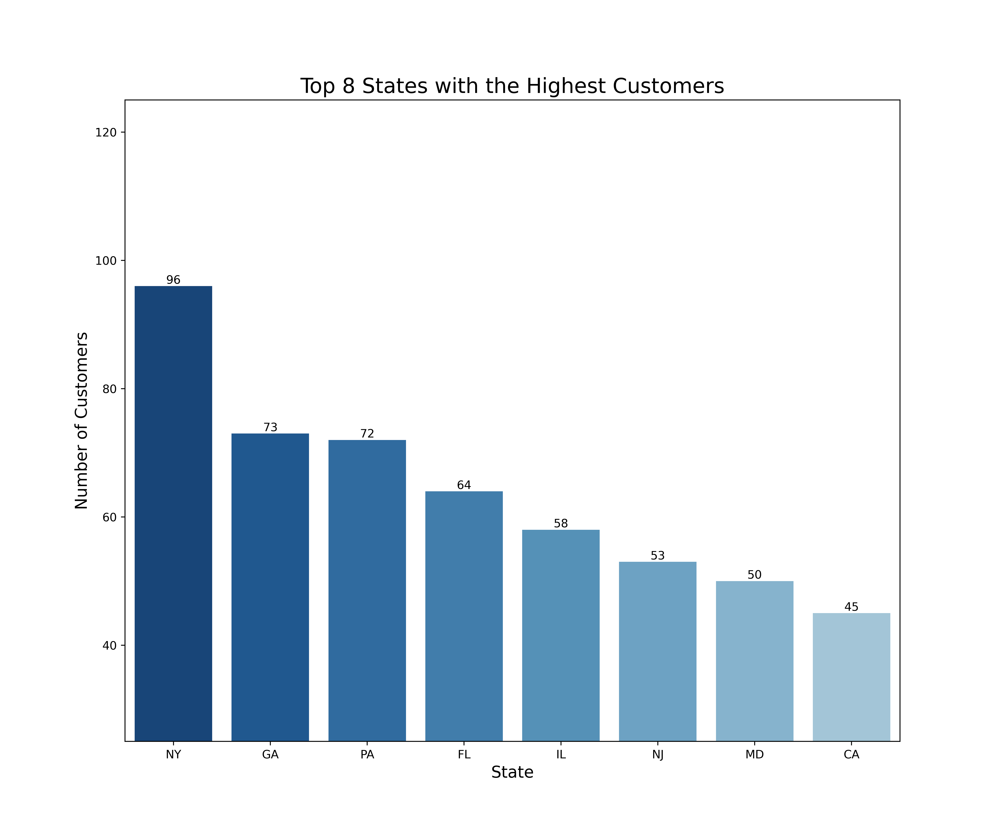
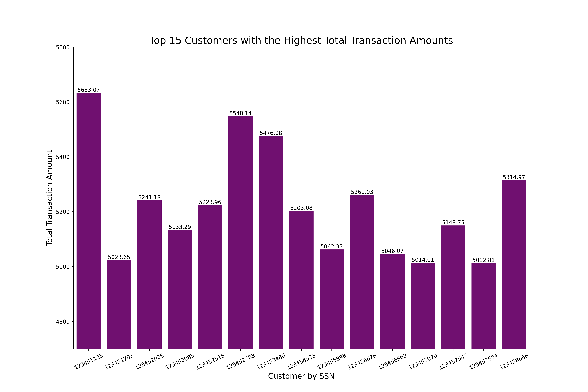
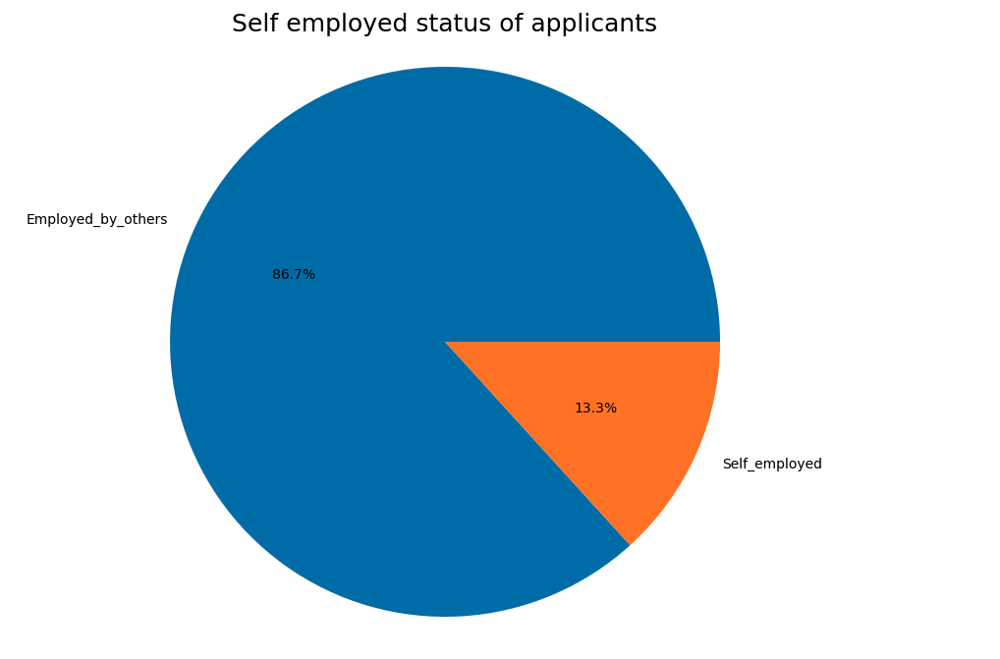
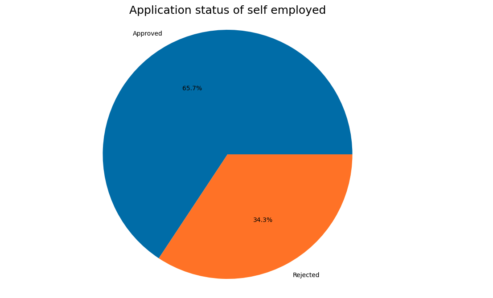
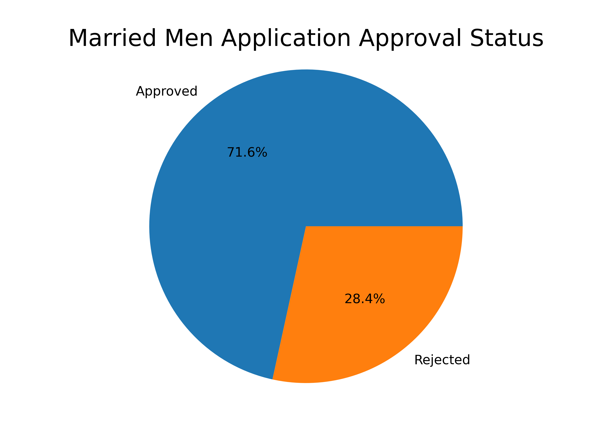
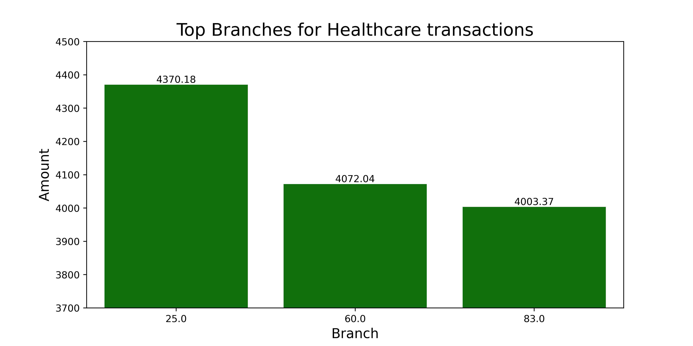
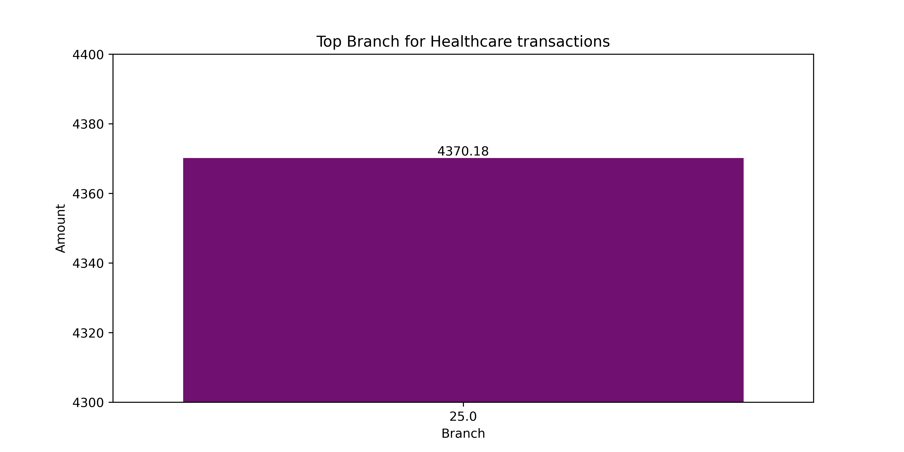
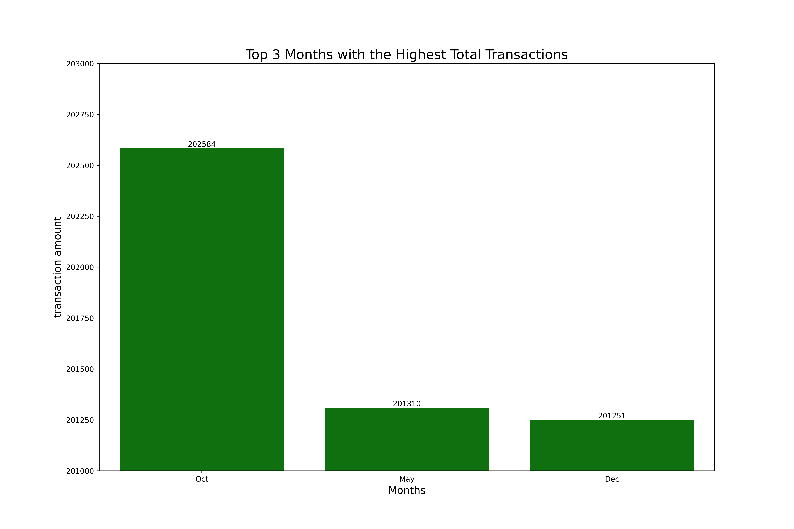

# Capstone Project for Perscholas Data Engineerig
This is the final project for the Perscholas Data Engineering bootcamp

## Overview
This project requires management of an ETL process, Data Analysis, and Data Visualization for:

-  Loan Application dataset 
-  Credit Card dataset

## Requirements
- there is a yml file which has the required libraries to install to duplicate this project but the core libraries are:
    : Python 
    : Pandas
    : Seaborn
    : Matplotlib
    : PySpark
- you will also need to download and install MySQL and Tableau

## Data Analysis and Visualization

Total transaction Amount by Transaction Type

Top 8 states by number of customers 

Top 15 customers by total transactions

Approval Rate for Self-Employeed individuals

Rejection percentage for married male applicants

## Technical Challenges
- there are some issues with connecting to the sql database using pyspark.
- I was able to connect and load all my cleaned dataframes into the mysql database I was using but I did get a lot of warnings.

Top branch by total transaction value for Healthcare

Top 3 months by total transactions

