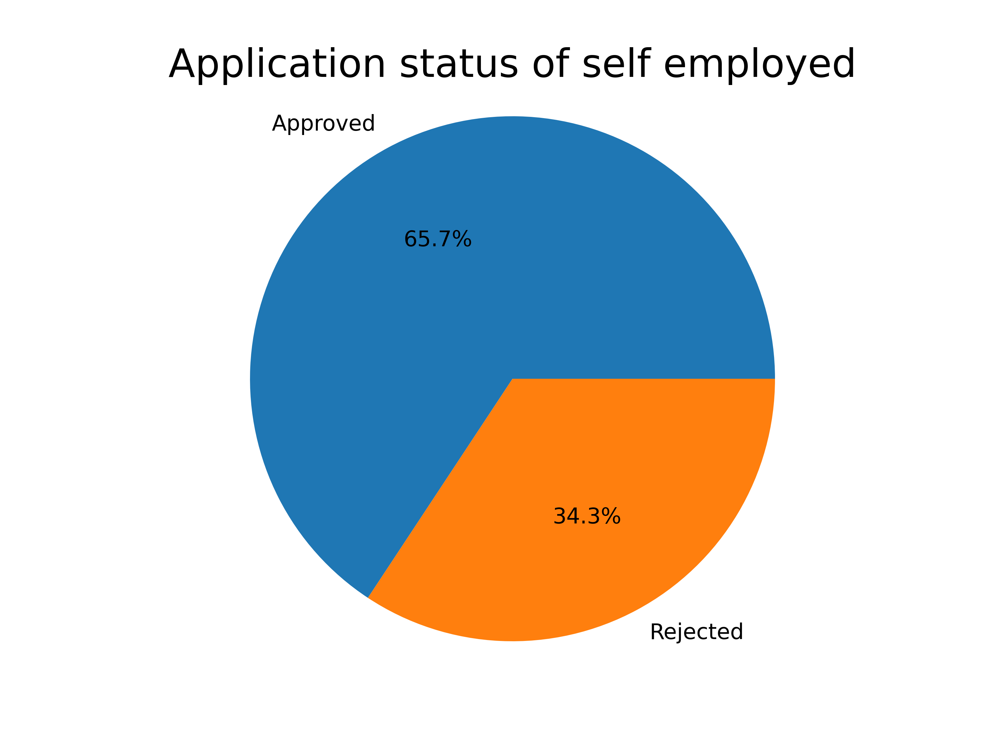
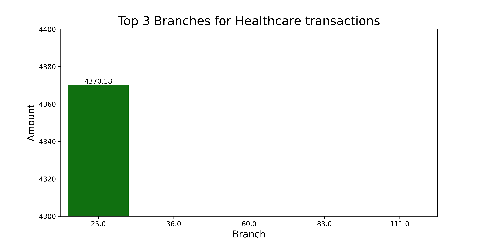

# Capstone Project for Perscholas Data Engineerig
This is the final project for the Perscholas Data Engineering bootcamp

## Overview
This project requires management of an ETL process, Data Analysis, and Data Visualization for:

-  Loan Application dataset 
-  Credit Card dataset

## Requirements
- the yml file has the required libraries to use to duplicate this project but the core libraries are:
    : Python 
    : Pandas
    : Seaborn
    : Matplotlib
    : MYSQL
    : PySpark

## Data Analysis and Visualization

Total transaction Amount by Transaction Type

Top 8 states by number of customer 

Top 15 customers by total transactions

Approval Rate for Self-Employeed individuals

Rejection percentage for married male applicants

Top branches by total transaction value for Healthcare

Top 3 months by total transactions

